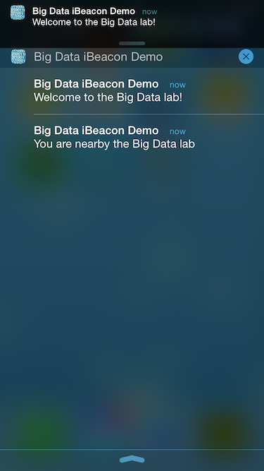
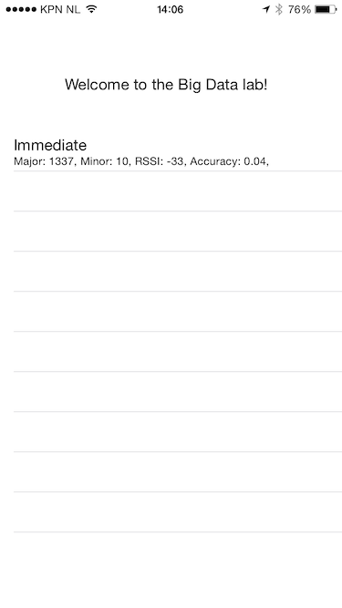

iBeacon Demo App
================
Simple iOS 8 Swift app showing how to use the iBeacon signals and trigger notifications. 
It can be used to find the Big Data lab (where I work) if you're nearby.

## Notifications

## Ranging

That's all it does right now... I might extend it with a webservice so that we can track where people are with a couple of beacons (e.g. in the lab, room of SK/EvdB, toilet...).

